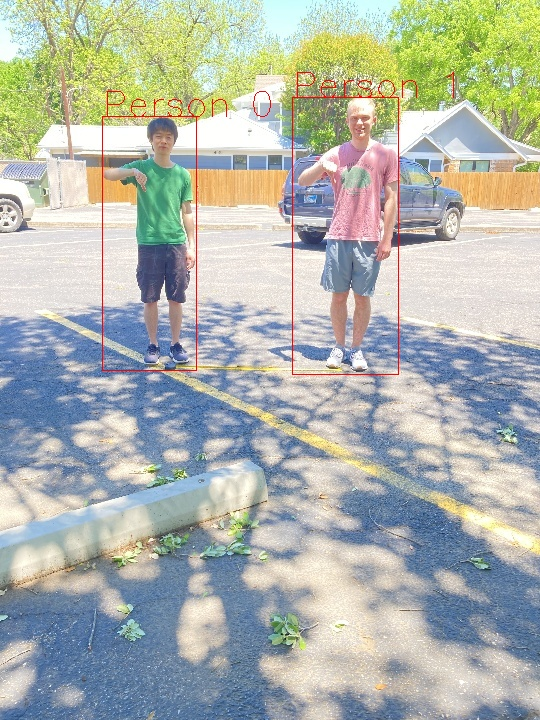
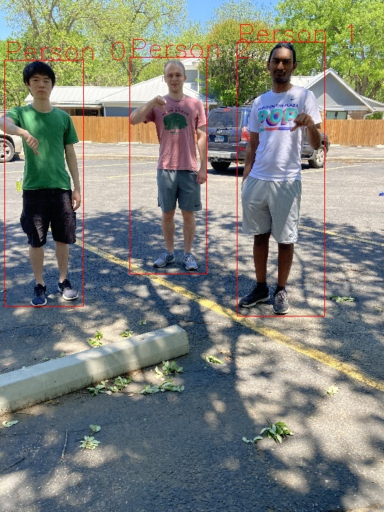
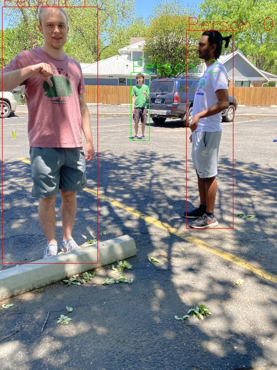

# Real Time Social Distancing Detector From Monocular Image


Our project identifies people in a monocular image and outputs a colored bounding box on them. A red bounding box indicates that they are not socially distanced and a green bounding box indicates that they are socially distanced. 

## Submodules

Uses YOLOv4 from https://github.com/Tianxiaomo/pytorch-YOLOv4 (as submodule). 

Uses pruning from https://github.com/SpursLipu/YOLOv3v4-ModelCompression-MultidatasetTraining-Multibackbone (as submodule)

### Initializing submodules from Git
To initialize the submodule, clone the repo with  

```
git clone --recurse-submodules https://github.com/snbcypher/social_distancing_violation_detector
```
or 
```
git clone https://github.com/snbcypher/social_distancing_violation_detector
git submodule update --init --recursive
```
## How to run
 - Ensure all the dependencies from ```requirements.txt``` are installed. 
 - Ensure submodules are actually cloned. 
 - Ensure you have your desired settings configured in ```sd_detector_cfg.py```. There are many configuration options so be sure you read the comments carefully. The repo is already setup to run images from the input_images folder. 
 - Run the following in the command line:
    ```
    python sd_detect.pty
    ```
- A window will pop up with the social distancing results as an image or video, depending on file type.
- Press 'q' at any time to close the pop-up.

### Test Images
Test files are provided in ```input_images```. The cfg file is configured correctly to handle the image files. We do not know the camera intrinsic matrix for the camera used to collect the video in ```input_images``` so the results in the video will not be perfect. 

## Cfg and weights mapping
The following pairs of weights and .cfg files go together. 
- ```yolov4-tiny-person.cfg``` & ```best_tinyyolov4_sparseforprune0.pt```
- ```yolov4-tiny-person.cfg``` & ```best_tinyyolov4_base50.pt```
- ```normal_prune_0.5_yolov4-tiny-person.cfg``` & ```best_normal_prune_0.5_finetune.pt```
- ```regular_prune_0.7_yolov4-tiny-person.cfg``` & ```best_regular_prune_0.7_finetune.pt```

## Examples
These are some example images of the project in action. In the provided images in ```input_images``` people in the picture with their thumbs down are not socially distanced. People with their thumbs up are socially distanced. 




